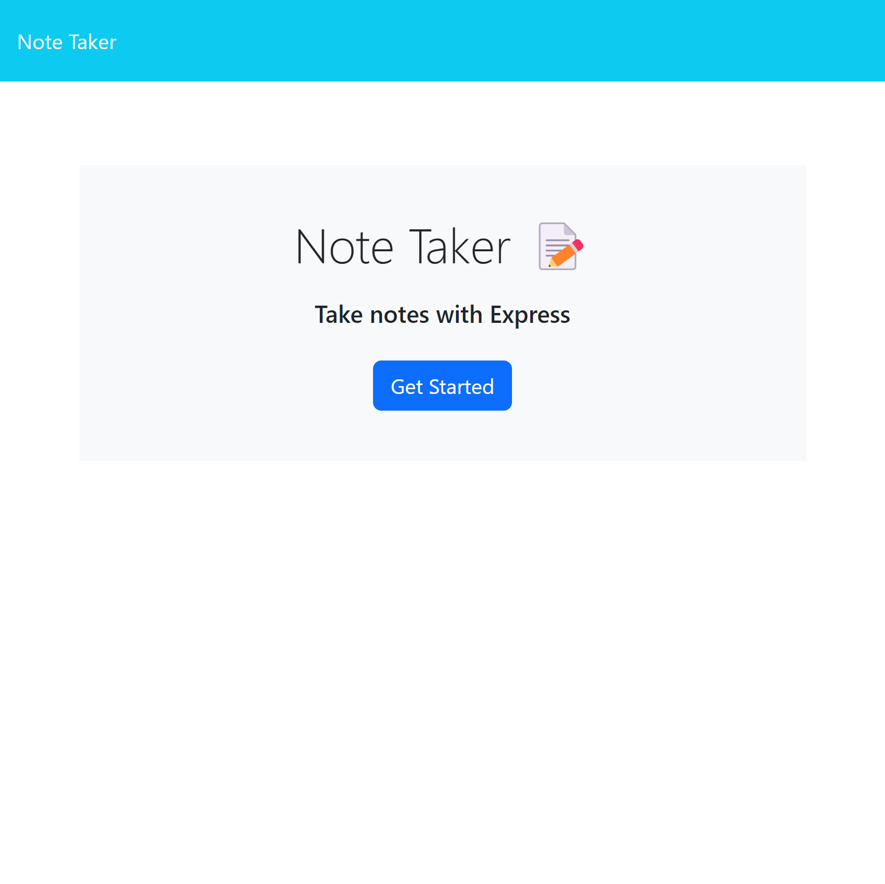
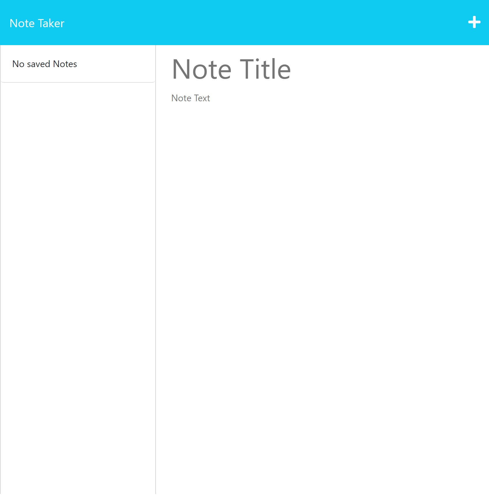
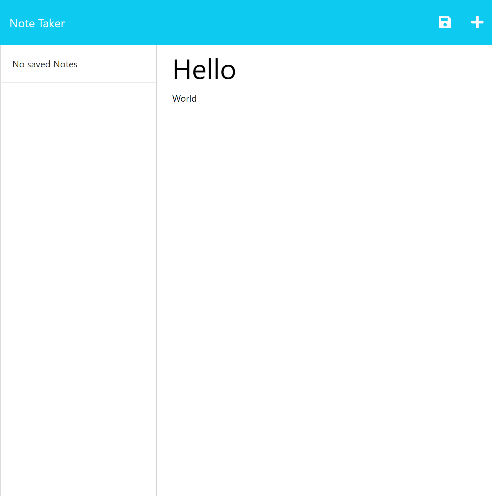
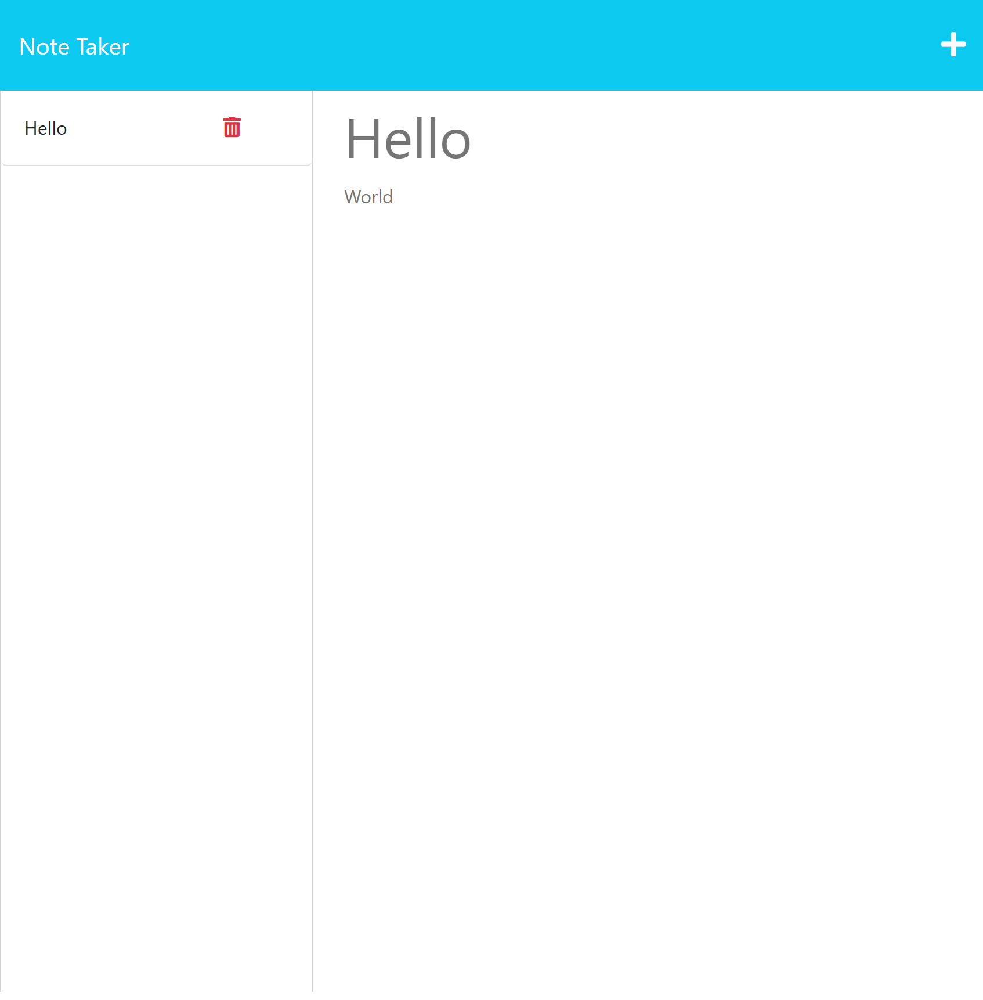

# Note-Taker

## Description

This project uses express and heroku to deploy the wepage. This project taught me how to create modular routes for API calls. Got practice with writing Get, Post and Delete routes for the application.

## Usage

On the landing page you will be presented with a page that has a button that will reroute users to the notes.html page.

After clicking on the Get Started Button you will be presented with the Notes page

On the notes page, after typing in the Note, you will be able to save the note by clicking on the save icon on the top right of the screen next to the + button which creates a new note.

After clicking on the save button the note will show up on the left side of the webpage, showing the title of the note that was saved, clicking on the note will display the note on the right side, clicking the trash bin will delete the note.

Live Deployed URL: https://glacial-hollows-20377.herokuapp.com/  
GitHub URL: https://github.com/TimeBytes/Note-Taker

## Credits

Starter code was provided by University of Toronto Boot camp  
https://github.com/coding-boot-camp/miniature-eureka

## License

MIT License
